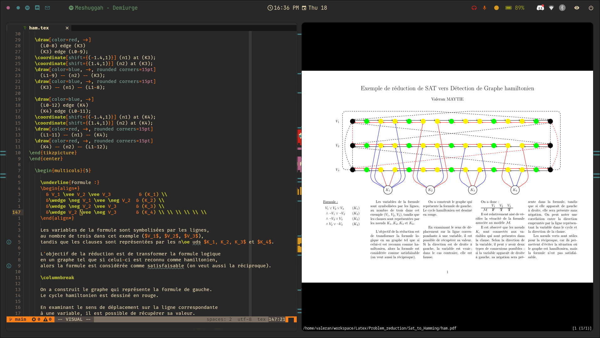

# My  Dotfiles

Hi, this is my directory containing my configuration files. 
I'm a big fan of the [gruvbox](https://github.com/morhetz/gruvbox)
theme, so I put it everywhere.

## Preview

<b><code>Wall </code></b>

<b><code>Nvim </code></b>

<b><code>Unix Porn </code></b>

## Aplications

I am on archlinux and use pacman and yay as package manager

### User Interface

1. [hyperland](https://hyprland.org/) - dynamic tiling Wayland 
    compositor
1. [swww](https://github.com/Horus645/swww) - A simple wayland 
    wallpaper setter
1. [waybar](https://github.com/Alexays/Waybar) - Highly customizable 
    Wayland bar
1. [rofi](https://github.com/lbonn/rofi) - A window switcher, Application 
    launcher and dmenu replacement. (Wayland fork)
1. [wdisplays](https://github.com/luispabon/wdisplays) - wdisplays is a graphical 
    application for configuring displays in Wayland compositors.
1. [dunst](https://github.com/dunst-project/dunst) - A highly configurable and 
    lightweight notification daemon.
1. [swaylock effect](https://github.com/mortie/swaylock-effects) - waylock is a 
    screen locking utility for Wayland compositors.
1. [pavucontrol](https://freedesktop.org/software/pulseaudio/pavucontrol/) - 
    PulseAudio Volume Control
1. [nm-applet](https://gitlab.gnome.org/GNOME/network-manager-applet) - Network 
    Manager tray icon and utility

### office

1. [nemo](https://github.com/linuxmint/nemo) - File Manager
1. [imv](https://github.com/eXeC64/imv) - Image viewer for X11 and Wayland
1. [gimp](https://github.com/snapcrafters/gimp) - The Free & Open Source Image Editor
1. [thunderbird](https://www.thunderbird.net/) - Email client
1. [discord](https://discord.com/) - 
1. [spotify](https://www.spotify.com/) -
1. [firefox](https://www.mozilla.org/) -

### Utils

1. [zsh](https://github.com/zsh-users/zsh) - Z shell
1. [nvim](https://github.com/neovim/neovim) - hyperextensible 
    Vim-based text editor ([nvim config](.config/nvim))
1. [kitty](https://github.com/kovidgoyal/kitty) - the fast, 
    feature-rich, cross-platform, GPU based terminal

## Inspiration

* I took some ideas from the hyprland [wall of fame](https://hyprland.org/rices)
* To learn how to configure nvim I started by following this 
    [nvim from scratch](https://github.com/LunarVim/Neovim-from-scratch)
* I've seen a lot of nice rofi configurations here 
    [rofi config colection](https://github.com/adi1090x/rofi)

## Thanks

Thanks to:

* [gurvan.dev](https://gitlab.com/Gurvan.dev) - For encouraging me at
    the beginning to switch to neovim and pkgs install script
* [josuemoreau](https://github.com/josuemoreau) - For finally motivating
    me to switch to hyprland
* [paulpatault](https://github.com/paulpatault) - To help me with neovim
